### CSSG.toolkit - R library for advanced cell subtypes selection


<br />


<p align="right">


</p>


### Author: Jakub Kubiś

<div align="left">
 Institute of Bioorganic Chemistry<br />
 Polish Academy of Sciences<br />


<br />

<p align="center">
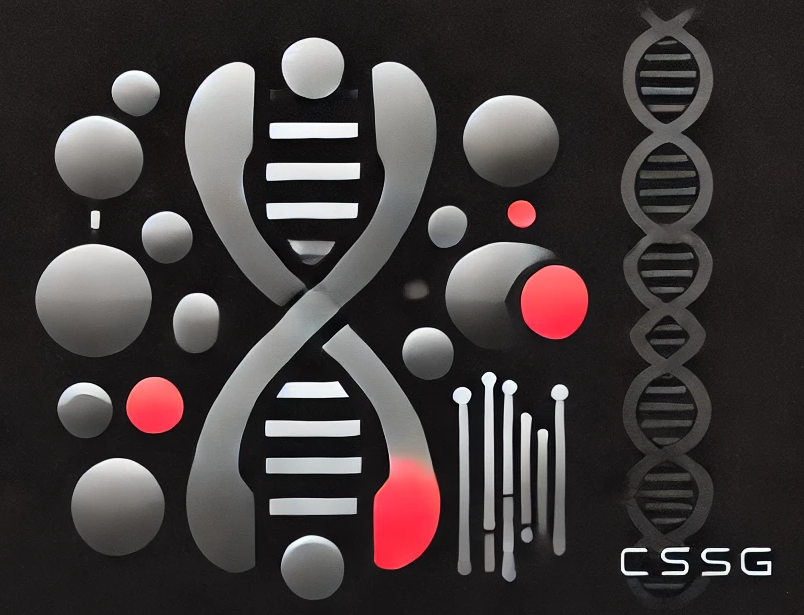
</p>

* Source: OpenAI, Image generated with support of the ChatGPT model (version 3.5), 2025.


<br />

## Description

A comprehensive toolkit providing methods for naming cell clusters, identifying marker genes, and conducting statistical analyses in single-cell RNA sequencing (scRNA-seq) data. These methods support the CSSG algorithm, which precisely subdivides heterogeneous cell clusters by analyzing binary gene occurrence patterns, iteratively selecting optimal gene combinations, and minimizing unexplained cell loss and heterogeneity.


<br />

#### Installation from GitHub

```
remotes::install_url(
  "https://github.com/jkubis96/CSSG/raw/refs/heads/main/packages/CSSG.toolkit_0.1.2.tar.gz",
  dependencies = TRUE
)
```
<br />


#### Loading

```
library(CSSG.toolkit)
```

<br />

#### Documentation

* [CSSG.tolkit](https://jkubis96.github.io/CSSG/)

<br />


#### Example usage with Seurat


##### Download GitHub repo with example data

```
#bin/bash

git pull https://github.com/jkubis96/CSSG.git

cd example

run example_usage_with_Seurat.Rmd using RStudio or other IDE
```

<br />


***Example run -> example_usage_with_Seurat.rmd***
* [example_usage_with_Seurat.Rmd](example/example_usage_with_Seurat.Rmd)


<br />

#### R code and results:

```
# Install required packages

if (!requireNamespace("remotes", quietly = TRUE)) {
  install.packages("remotes")
}

if (!requireNamespace("Seurat", quietly = TRUE)) {
  install.packages("Seurat")
}

remotes::install_local(
  "../packages/CSSG.toolkit_0.1.2.tar.gz",
  dependencies = TRUE
)

library(CSSG.toolkit)
library(Seurat)
library(openxlsx)
library(dplyr)
```

<br />

##### Load sparse matrix data (CSSG.toolkit)

```
# load normalized example data
sc_project <- create_project(sparse_matrix_path = '../benchmark/data/', sparse_name = 'matrix', rows_name = 'genes', cols_name = 'barcodes', type = 'norm')

# make unique barcodes
colnames(sc_project@matrices$norm) <- make.unique(colnames(sc_project@matrices$norm))
```

<br />

##### Create SeuratObject (Seurat)

```
# create seurat object
UMI <- CreateSeuratObject(counts = sc_project@matrices$norm)
```


<br />

##### Features content plot (Seurat)

```
UC_plot <- VlnPlot(UMI, features = c("nFeature_RNA"), ncol = 1)
UC_plot
```


<p align="center">
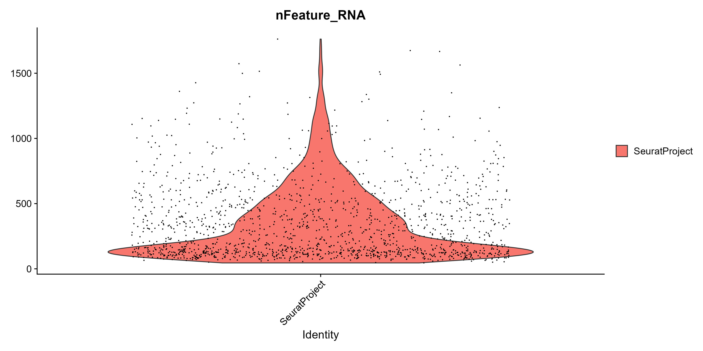
</p>


<br />

##### Ribo & Mito content (Seurat)


```
UMI[['MitoPercent']] <- PercentageFeatureSet(UMI, pattern = "^MT-") + PercentageFeatureSet(UMI, pattern = "^Mt-") + PercentageFeatureSet(UMI, pattern = "^mt-")
UMI[['RiboPercent']] <- PercentageFeatureSet(UMI, pattern = "^Rps-") + PercentageFeatureSet(UMI, pattern = "^Rpl") + PercentageFeatureSet(UMI, pattern = "^RPS-") + PercentageFeatureSet(UMI, pattern = "^RPL")

MR_plot <- VlnPlot(UMI, features = c("RiboPercent", "MitoPercent"), ncol = 2)
MR_plot
```


<p align="center">
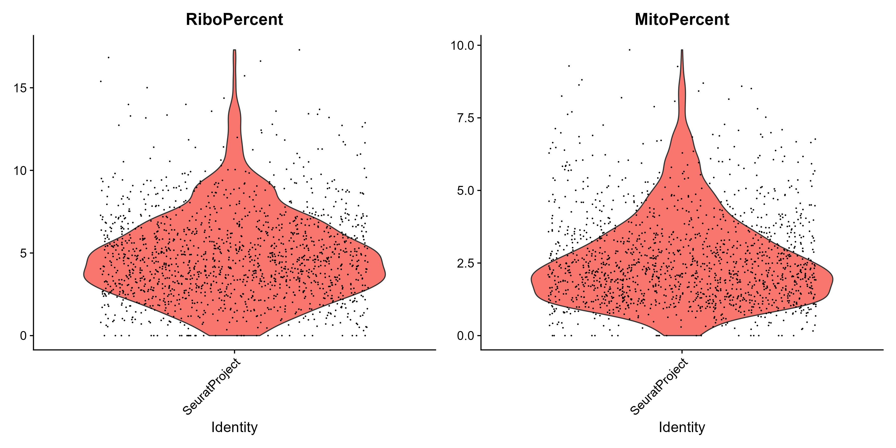
</p>


<br />

##### Threshold estimation for minimum [no cells] and maximum [multiple cells] (CSSG.toolkit)


```
#Droplet content and QC

thresholds <- outlires(UMI@meta.data$nFeature_RNA)

# Estimated thresholds
print(thresholds$thresholds)

# Estimated thresholds - histogram
thresholds$plot
```


<p align="center">
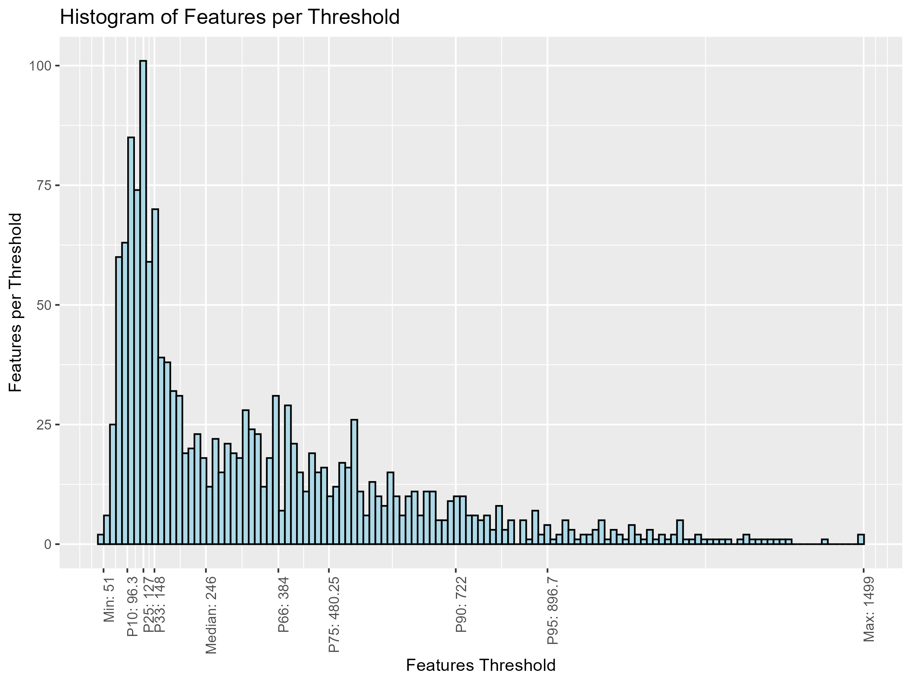
</p>

<br />


##### Reducing SeuratObject based on estimated thresholds (Seurat)

```{r  include=FALSE}

# Reduce sc_data using min / max estimated 

UMI <- subset(UMI, subset = nFeature_RNA > thresholds$thresholds[1] & nFeature_RNA <= thresholds$thresholds[length(thresholds$thresholds)]
 & MitoPercent < 20)


# Since we have already loaded normalized data, 
# there is no need to use the normalization function. 
# In this case, we place the loaded data in the appropriate slot.

UMI@assays$RNA$data <- UMI@assays$RNA$counts
```

<br />


##### Find Variable Features (Seurat)


```
UMI <- FindVariableFeatures(UMI, selection.method = "vst", nfeatures = 5000, binning.method = 'equal_frequency')

# Identify the 10 most highly variable genes

top20 <- head(VariableFeatures(UMI), 20)

plot1 <- VariableFeaturePlot(UMI)

plot2 <- LabelPoints(plot = plot1, points = top20, repel = TRUE)

plot2
```


<p align="center">
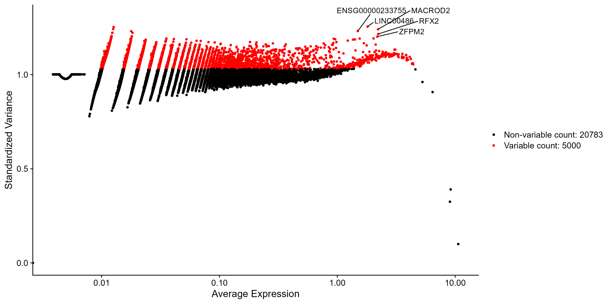
</p>

<br />


##### Scale data and PCA (Seurat)

```
all.genes <- rownames(UMI)
UMI <- ScaleData(UMI, features = all.genes)

UMI <- RunPCA(UMI, features = VariableFeatures(object = UMI))
```

<br />

##### Create Elbow plot for PCs (Seurat)


```
Elbow <- ElbowPlot(UMI, ndims = 50)

dims <- as.data.frame(Elbow$data$stdev)
```

<br />

##### Find important PCs threshold (CSSG.toolkit)

```
# This function searches for the threshold that minimizes the difference between consecutive components

dim <- dim_reuction_pcs(dims)

print(dim)
```

<br />

##### Display Elbow plot with estimated threshold for PCs (Seurat)


```
Elbow <- Elbow + geom_vline(xintercept = dim, color = 'red') +   
    geom_text(aes(x = dim + 3, y = round(max(Elbow$data$stdev)/2,0), label = paste("Dim =", dim)), color = 'red', vjust = -1)
```


<p align="center">
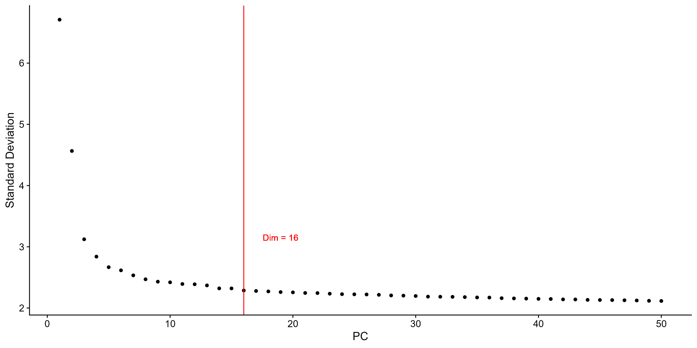
</p>

<br />

##### Selection only significant PCs (Seurat)


```
UMI <- JackStraw(UMI, num.replicate = 10, dims = dim)
UMI <- ScoreJackStraw(UMI, dims = 1:dim)

#Select significient PCs
jc <- as.data.frame(UMI@reductions$pca@jackstraw@overall.p.values)
jc <- jc[jc$Score < 0.05,]
dim <- as.vector(jc$PC)

plot <- JackStrawPlot(UMI, dims = dim)

plot
```

<p align="center">
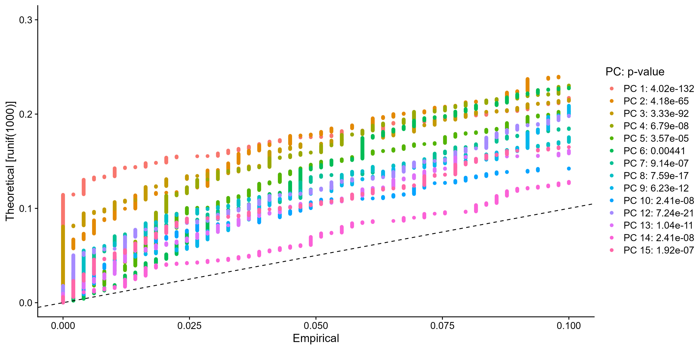
</p>

<br />


##### Clustering & visualization (Seurat)

```
UMI <- FindNeighbors(UMI, dims = dim, reduction = 'pca', nn.method="rann")
UMI <- FindClusters(UMI, resolution = 0.6, n.start = 10, n.iter = 1000)

UMI <- RunUMAP(UMI, dims = dim)

umap_plot <- DimPlot(UMI, reduction = "umap", raster = FALSE)

umap_plot
```

<p align="center">
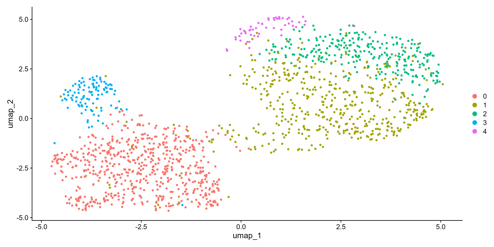
</p>

<br />


##### Convert SeuratObject to sc_project using CSSG.toolkit (CSSG.toolkit).

```
sc_project <- create_project_from_seurat(UMI)
```


<br />

##### Selecting cluster specyfic markers for subclasses naming (CSSG.toolkit)


```
# get markers for subclass naming
sc_project <- get_cluster_stats(sc_project = sc_project, type = 'primary', only_pos = TRUE)


# select markers for subclass naming
sc_project <- namign_genes_selection(sc_project, type = 'primary', top_n = 25,
                              p_val = 0.05, select_stat = "p_val",
                              mito_content = FALSE, ribo_content = FALSE)
```

<br />

<br />

##### Selecting heterogeneity markers for CSSG (CSSG.toolkit)


* ###### Selecting heterogeneity based on Mann-Whitney statistic [compare between clusters] (CSSG.toolkit)

```
# select markers for CSSG algorithm based on cluster-specific markers calcualted with get_cluster_stats()

sc_project <- heterogeneity_select_specificity(sc_project = sc_project, 
                                                             type = 'primary', 
                                                             heterogeneity_factor = 0.80, 
                                                             p_val =  0.05, 
                                                             max_genes =  1000, 
                                                             select_stat = 'p_val',  
                                                             min_occ = 5, 
                                                             mito_content = FALSE)
```

<br />

* ###### Selecting heterogeneity based on variance [variance inside cluster] (CSSG.toolkit)

```
# select markers for CSSG algorithm based on inside variance

sc_project <- heterogeneity_select_variance(sc_project = sc_project, 
                                                          heterogeneity_factor = 0.80, 
                                                          max_genes = 1000, 
                                                          min_occ = 5, 
                                                          min_exp = 0.1, 
                                                          rep_factor = 0.2, 
                                                          mito_content = FALSE)
```

<br />


##### Selecting CSSG markers for discovering cell subtypes (CSSG.toolkit)


```
sc_project <- CSSG_markers(sc_project = sc_project, max_combine = 1000, loss_val = 0.05)
```

<br />

###### CSSG algorithm workflow:


<p align="center">
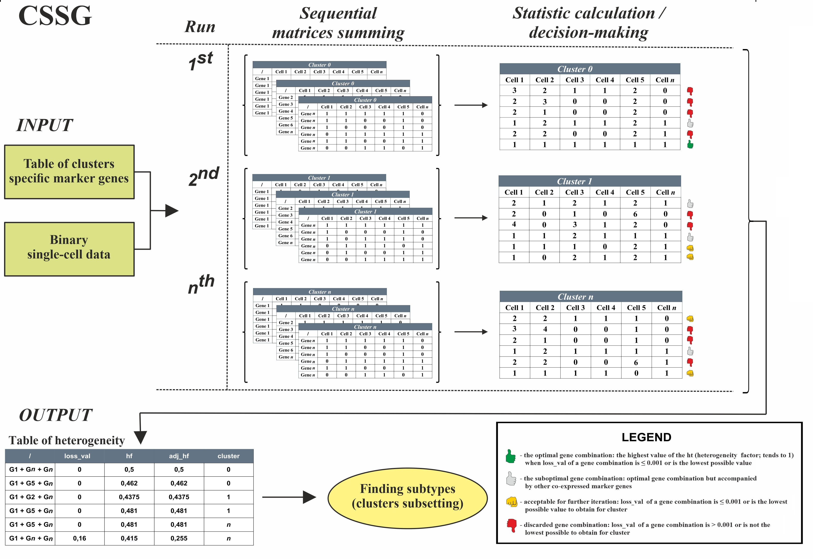
</p>


<br />

##### Loading subclass and subtypes markers

```
# load predefinied markers for subclass naming
markers_class = read.xlsx('../markers/markers_developing_brain.xlsx', sheet = 1)
markers_subclass = read.xlsx('../markers/markers_developing_brain.xlsx', sheet = 2, colNames = F)

# or
# load an empty spreadsheet for the example analysis
# a spreadsheet with non-canonical naming will return NULL for both variables
```

<br />

##### Canonical markers structure in the spreadsheet (eg. Excel)

User-defined markers are stored in an Excel file within the project directory under /markers. The file contains two types of markers:

* marker_class - structure

<p align="center">
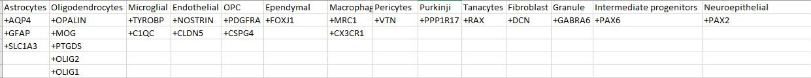
</p>

You can modify the markers based on your data and experiments. However, if you define your own markers for cell classes, ensure that you prefix the marker gene names with a +. Gene markers without the + symbol will not be recognized. It’s good practice to save markers that are not used in the analysis to maintain clarity and organization.

* markers_subclass - structure


<p align="center">

</p>


In the case of subclass markers, you do not need to add the additional + for the markers. If you only want class names based on canonical markers, simply leave the sheet for subclass markers empty. In this case, the algorithm will automatically assign non-canonical markers for the subclass.

<br />

###### Avaiable markers data:

* mature brain
* developing brain
* non-canonical

<p align="center">

</p>


<br />

##### Cells naming [class / subclass / subtypes] (CSSG.toolkit)


###### Cell names structure:


<p align="center">
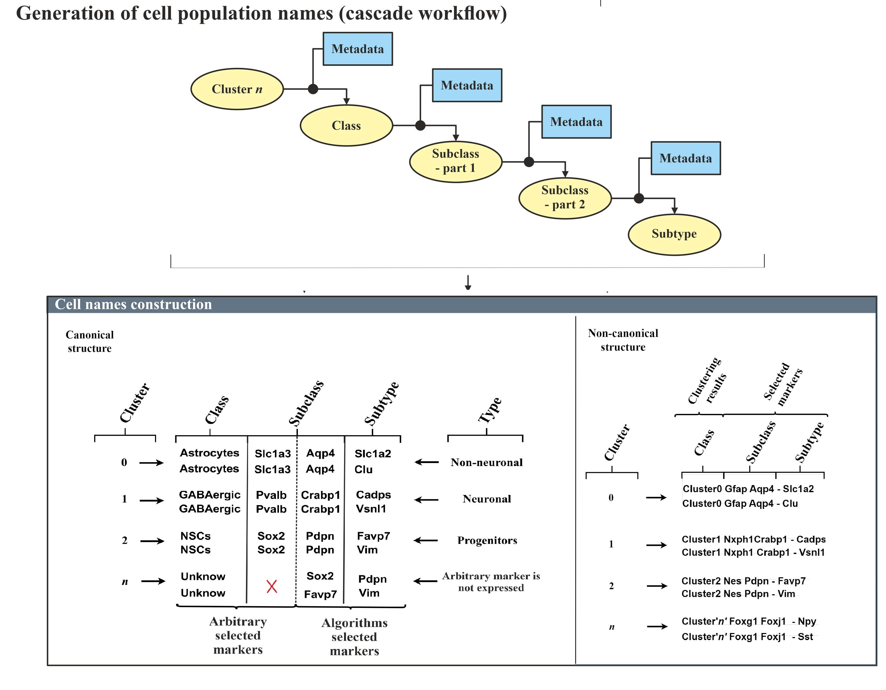
</p>

<br />

##### Class & Subclass naming (CSSG.toolkit)

```
sc_project <- subclass_naming(sc_project = sc_project, class_markers = markers_class, subclass_markers = markers_subclass, species = 'Homo sapiens', chunk_size = 5000)
```

<br />

##### Class / Subclass distribution (CSSG.toolkit)


```
# At this step, it is recommended not to remove non-significant subclasses.

data <- bin_cell_test(p_val = 0.05, names = sc_project@names$subclass, min_cells = 20)

threshold <- cell_stat_graph(data$data)

threshold
```


<p align="center">
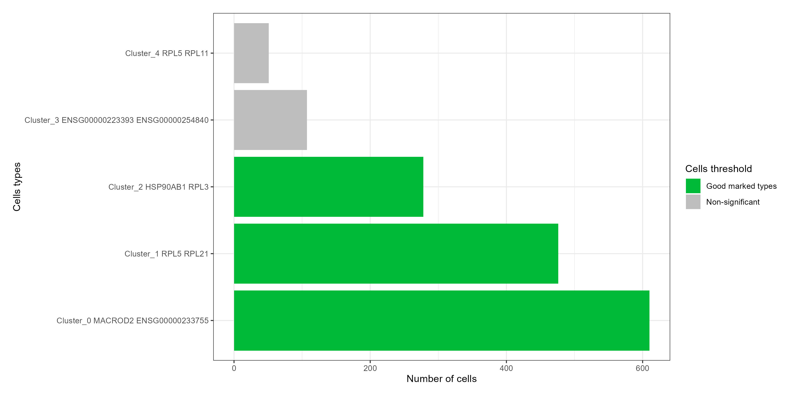
</p>

<br />

##### Subtypes and naming (CSSG.toolkit)


```
sc_project <- subtypes_naming(sc_project = sc_project, markers_class = markers_class, markers_subclass = markers_subclass, species = 'Homo sapiens') 
```

<br />

##### Subtypes distribution (CSSG.toolkit)


* ###### Full-wide subtypes distribution plot (CSSG.toolkit)


```
thr_data <- bin_cell_test(p_val = 0.05, names = sc_project@names$repaired, min_cells = 10)

threshold <- cell_stat_graph(thr_data$data, include_ns = TRUE)

threshold
```


<p align="center">
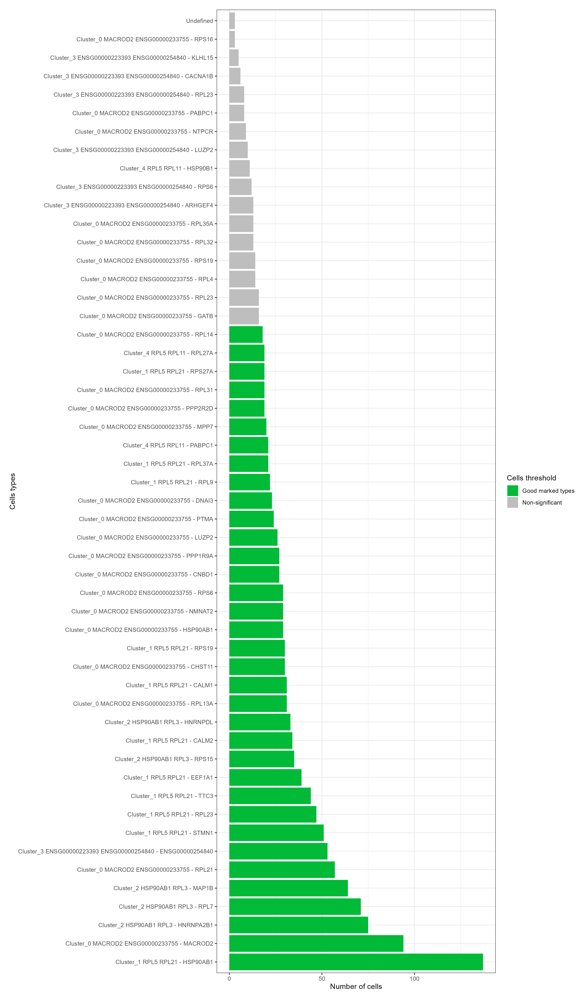
</p>


* ###### Reduced subtypes distribution plot (CSSG.toolkit)


```
thr_data <- bin_cell_test(p_val = 0.05, names = sc_project@names$repaired, min_cells = 10)

threshold <- cell_stat_graph(thr_data$data, include_ns = FALSE)

threshold
```


<p align="center">
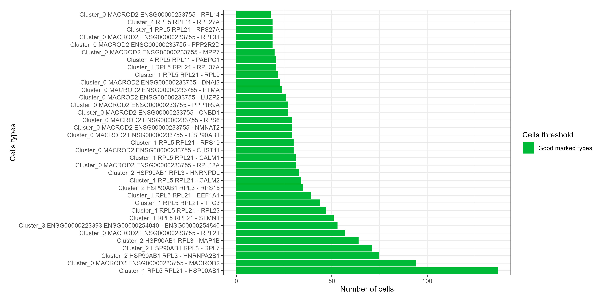
</p>


<br />

##### Subset sc_project (CSSG.toolkit)


```
select_list <- thr_data$data$names[thr_data$data$test %in% c("Good marked types", "Renamed")]

sub_sc_project <- subset_project(sc_project = sc_project, type = 'subtypes', select_list = select_list)
```

<br />

##### Get sc_project data (CSSG.toolkit)

```
# full sparse matrix

data <- get_data(sc_project = sub_sc_project, type = 'subtypes', data = 'norm')

# average expression matrix

data_avg <- get_avg_data(sc_project = sub_sc_project, type = 'subtypes', data = 'norm')
```


```
# subtypes marker selection

sub_sc_project <- get_cluster_stats(sc_project = sub_sc_project, type = 'subtypes', only_pos = TRUE, min_pct = 0.05)

markers <- sub_sc_project@metadata$subtypes_markers

markers5 <- markers %>%
  group_by(cluster) %>%
  arrange(cluster,  p_val, desc(avg_logFC), desc(perc)) %>%  
  slice_head(n = 5)
```

Example data:

|genes           |perc              |avg_logFC         |p_val                |cluster                                                    |
|----------------|------------------|------------------|---------------------|-----------------------------------------------------------|
|CHST11          |1                 |2.45321939800928  |9.62045978362435e-33 |Cluster_0 MACROD2 ENSG00000233755 - CHST11                 |
|ENSG00000271382 |0.0666666666666667|8.33695730286168  |7.00708907745412e-21 |Cluster_0 MACROD2 ENSG00000233755 - CHST11                 |
|LINC02482       |0.0666666666666667|6.49702222475565  |3.59042219304769e-14 |Cluster_0 MACROD2 ENSG00000233755 - CHST11                 |
|LBX1            |0.0666666666666667|6.49266330468258  |3.59042219304769e-14 |Cluster_0 MACROD2 ENSG00000233755 - CHST11                 |
|WDR72           |0.0666666666666667|5.61761984168418  |8.46364661993546e-11 |Cluster_0 MACROD2 ENSG00000233755 - CHST11                 |
|CNBD1           |1                 |2.96748581038927  |8.294515545625e-40   |Cluster_0 MACROD2 ENSG00000233755 - CNBD1                  |
|MMEL1           |0.0740740740740741|8.54091696454573  |4.51219882646058e-23 |Cluster_0 MACROD2 ENSG00000233755 - CNBD1                  |
|ENSG00000237372 |0.111111111111111 |5.69680610814913  |3.89925049952097e-17 |Cluster_0 MACROD2 ENSG00000233755 - CNBD1                  |
|JAML            |0.0740740740740741|6.80398432179015  |1.21181657787058e-15 |Cluster_0 MACROD2 ENSG00000233755 - CNBD1                  |
|PPP1R17         |0.0740740740740741|5.40809018141022  |1.16261209372285e-09 |Cluster_0 MACROD2 ENSG00000233755 - CNBD1                  |
|DNAI3           |1                 |3.83999464741714  |1.78704673813297e-56 |Cluster_0 MACROD2 ENSG00000233755 - DNAI3                  |
|SLC2A12         |0.0869565217391304|8.74306226043921  |7.05786134557164e-27 |Cluster_0 MACROD2 ENSG00000233755 - DNAI3                  |
|ARHGAP25        |0.0869565217391304|8.73095314176115  |7.05786134557164e-27 |Cluster_0 MACROD2 ENSG00000233755 - DNAI3                  |
|RCOR2           |0.0869565217391304|6.90138237851629  |3.38034397536091e-18 |Cluster_0 MACROD2 ENSG00000233755 - DNAI3                  |
|LINC00211       |0.0869565217391304|6.89441139638134  |3.38034397536091e-18 |Cluster_0 MACROD2 ENSG00000233755 - DNAI3                  |
|HSP90AB1        |1                 |1.2927386339063   |1.34062039665968e-20 |Cluster_0 MACROD2 ENSG00000233755 - HSP90AB1               |
|GAB3            |0.103448275862069 |5.72395375174977  |5.06503583595405e-16 |Cluster_0 MACROD2 ENSG00000233755 - HSP90AB1               |
|LINC01605.chr8.1|0.103448275862069 |5.76113321178576  |5.24237020451697e-16 |Cluster_0 MACROD2 ENSG00000233755 - HSP90AB1               |
|ENSG00000227400 |0.0689655172413793|6.65800559110553  |1.25355781071738e-14 |Cluster_0 MACROD2 ENSG00000233755 - HSP90AB1               |
|KCNK9           |0.0689655172413793|5.74683413775072  |3.95589334643106e-11 |Cluster_0 MACROD2 ENSG00000233755 - HSP90AB1               |
|LUZP2           |1                 |3.6378569841645   |9.15734621094442e-56 |Cluster_0 MACROD2 ENSG00000233755 - LUZP2                  |
|CEACAM1         |0.0769230769230769|6.70805261015722  |3.29613736644522e-16 |Cluster_0 MACROD2 ENSG00000233755 - LUZP2                  |
|ENSG00000253824 |0.0769230769230769|6.58543595299529  |3.29613736644522e-16 |Cluster_0 MACROD2 ENSG00000233755 - LUZP2                  |
|ENSG00000248138 |0.0769230769230769|6.12379457340412  |2.44708577515966e-12 |Cluster_0 MACROD2 ENSG00000233755 - LUZP2                  |
|LINC01681       |1                 |0.381440259831386 |2.65939179439888e-10 |Cluster_0 MACROD2 ENSG00000233755 - LUZP2                  |


<br />


##### Retrieve subclass and subtype markers and visualize them (CSSG.toolkit)


```
markers <- get_names_markers(sub_sc_project, type = 'subtypes') 

# normalized data (normalized expression)
plot <- marker_heatmap(sub_sc_project, type = 'subtypes', markers = markers, angle_col = 270, fontsize_row = 7, fontsize_col = 7, font_labels = 8, clustering_method = 'complete', x_axis = 'Cells', y_axis = 'Genes [log(CPM +1)]', scale = F)

# scaled normalized data (scaled normalized expression with values 0-1)
plot <- marker_heatmap(sub_sc_project, type = 'subtypes', markers = markers, angle_col = 270, fontsize_row = 7, fontsize_col = 7, font_labels = 8, clustering_method = 'complete', x_axis = 'Cells', y_axis = 'Scaled(Genes [log(CPM +1)])', scale  = T)

plot
```


<p align="center">
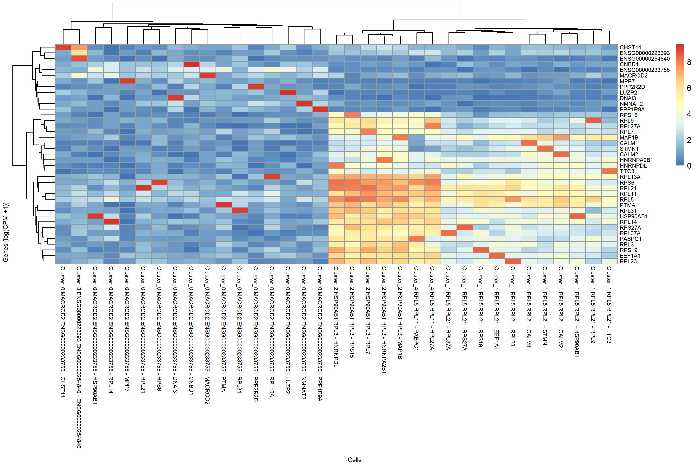
</p>


<br />

<br />


#### Have fun JBS©